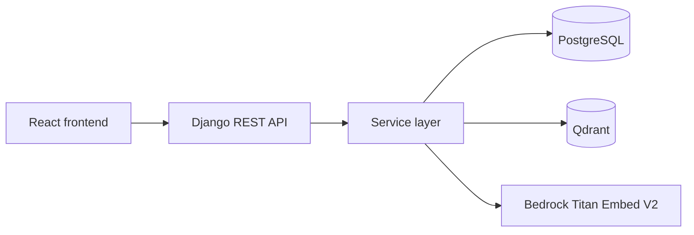
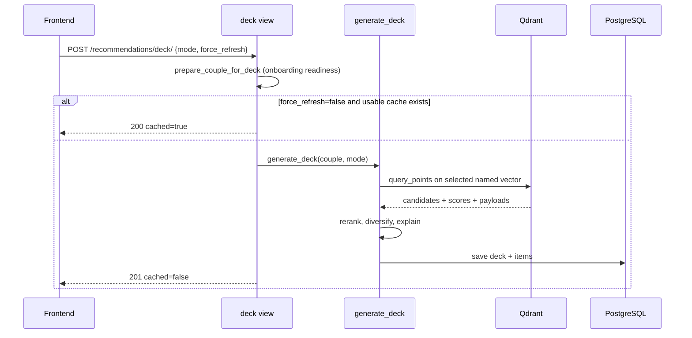
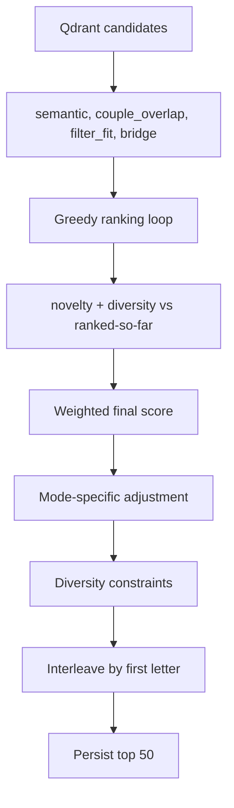

# BabyBase Technical Breakdown

How recommendations, matching, vector search, and the name map work. For engineers modifying the recommendation stack.

## System Overview

Mobile-first baby-name app. Users swipe through decks; a mutual match is created when both partners in a couple like the same active name. Recommendation quality comes from:

- Onboarding preferences (PostgreSQL).
- Name metadata: origin, language, style, length, historical importance.
- Bedrock Titan Embed V2 embeddings (1024-dim).
- Qdrant vector search across three named vector spaces.
- Server-side reranking (relevance, novelty, diversity, bridge).
- Per-user taste vectors learned from swipes once behavioral data is strong enough.



## Code Map

| Area | Main files | Responsibility |
| --- | --- | --- |
| Deck API | `core/views/recommendations.py` | Validate request, reuse cached decks, response envelopes. |
| Deck creation | `core/services/recommendations.py` | Select vector space, query Qdrant, rerank, diversify, persist. |
| Relevance scoring | `core/services/relevance.py` | Weighted relevance signals in `[0.0, 1.0]`. |
| Swipes/matches | `core/views/swipes.py`, `core/services/swipes.py` | Validate provenance, record swipes, create matches, similar-name search. |
| Taste vectors | `core/services/taste_vectors.py` | Learn per-user vectors; decide Phase C vs D. |
| Embeddings | `core/services/embeddings.py` | Build embedding text, call Bedrock. |
| Qdrant access | `core/services/qdrant_client.py` | Search named vectors, filter payloads, retrieve anchors. |
| Indexing | `core/management/commands/index_names_to_qdrant.py` | Generate named vectors + payloads for active names. |
| PCA projection | `core/services/projection.py`, `compute_projections.py` | 1024-dim semantic vectors → 2D map coords. |
| Name map | `core/services/name_map.py` | Assemble map points, statuses, neighborhoods. |

## Data Model

- `Name`: canonical record with metadata and optional `x_2d`/`y_2d` map coords.
- `NameVectorIndexRef`: maps a `Name` to a Qdrant point ID.
- `Couple`: the scope for swipes, matches, decks, exclusions.
- `Swipe`: a user's `like` / `dislike` / `maybe` on a name.
- `MutualMatch`: created when both partners in a two-person couple like the same name.
- `RecommendationDeck` / `RecommendationDeckItem`: cached batch for one couple+mode; items store score, rank, explanation, retrieval metadata.
- `UserTasteVector`: learned per-user vector for Phase D after enough reliable swipes.

**Key invariant:** swipes and matches are scoped to the user's current couple, never global.

## Vector Indexing

Each active name is indexed into Qdrant with three named 1024-dim vectors, all from Titan Embed V2 but built from different text views of the name.

| Vector | Built from | Used by |
| --- | --- | --- |
| `semantic` | Meaning, origin, style, significance, summary | best_match, bridge_names, more_like_this, wildcard, PCA map |
| `phonetic_style` | Pronunciation / sound-shape features | sounds_like |
| `cross_cultural` | Languages, scripts, variants, international usability | cross_cultural |

`index_names_to_qdrant` writes the points and `NameVectorIndexRef` rows. Qdrant payload fields:

`name_id`, `canonical_name`, `gender_usage`, `origin_backgrounds`, `languages`, `length_category`, `age_style_category`, `historical_importance` (string: `high`/`moderate`/`low`), `international_score`, `active`. Payload indexes exist for the filterable fields: `active`, `gender_usage`, `length_category`, `age_style_category`.

> Accuracy note: the payload stores the derived string `historical_importance`, not the float `historical_significance_score`. Reranking's `filter_fit` reads `historical_significance_score`, so in the live deck pipeline its historical axis is usually absent and contributes nothing — `filter_fit` effectively scores length and age. Closing this gap requires adding the score to the payload and reindexing.

When embedding text builders or the payload schema change, existing vectors are stale until reindexed.

## Deck Generation

```http
POST /api/v1/recommendations/deck/   { "mode": "best_match", "force_refresh": false }
```

`force_refresh`: initial loads use `false`; manual refreshes use `true`. Cached responses return `200` with `"cached": true`; fresh decks return `201` with `"cached": false`.



**Couple preparation** (`prepare_couple_for_deck`): solo users who finished solo onboarding get decks without a partner; two-person couples need both onboarded.

**Cache reuse** requires all of: same couple, same mode, not expired, still has unswiped items, and `force_refresh` was not `true`.

## Recommendation Modes

| Mode | Query embedding | Vector | Intent |
| --- | --- | --- | --- |
| `best_match` | Phase D taste midpoint if both users trusted, else Phase C couple profile | `semantic` | Best overall |
| `bridge_names` | Bridge centroid of both parents | `semantic` | Connect both backgrounds |
| `more_like_this` | Avg semantic vector of mutual matches | `semantic` | Similar meaning/style |
| `sounds_like` | Avg phonetic vector of mutual matches | `phonetic_style` | Similar sound |
| `cross_cultural` | Avg cross-cultural vector of mutual matches, else profile fallback | `cross_cultural` | Travels across cultures |
| `wildcard` | Couple profile embedding, wider retrieval + rerank boost | `semantic` | Plausible surprises |

## Phase C vs Phase D

The system starts at Phase C (stated preferences) and moves to Phase D (learned taste) once behavior is strong enough.

**Phase C** turns the merged couple profile into a `semantic` query: gender, parent backgrounds, residence country, style, length, historical importance.

**Phase D** uses learned taste vectors. Trust thresholds (`TRUST_THRESHOLDS` in `taste_vectors.py`):

| Threshold | Value |
| --- | --- |
| Min swipes | 20 |
| Min like rate | 0.1 |
| Max like rate | 0.8 |
| Max staleness | 30 days |
| Min retrieval score | 0.6 |

Taste vector mechanics:

- Recomputed every `TASTE_VECTOR_BATCH_SIZE = 5` swipes per user (not every card), since recompute fetches all liked embeddings from Qdrant.
- Built as a recency-weighted like centroid (14-day half-life). If like rate is very high and enough dislikes exist, the dislike centroid repels the vector.
- Confidence reflects swipe count, like-rate quality, staleness, and fallback quality.
- For a couple, the Phase D query is the confidence-weighted midpoint of both trusted user vectors. If either user fails a threshold, fall back to Phase C.
- Phase D only affects newly generated `best_match` decks; cached decks stay stable until refreshed, expired, or exhausted.

> Accurate framing: BabyBase learns from swipe history in batches and applies it when generating fresh best-match decks once both partners have enough reliable signal — not instantly per swipe.

**Known limitations:** taste vectors are per-user (can carry history across couple contexts); a single centroid blurs multiple taste clusters; dislikes mostly act by exclusion; cached decks hide improvements until refresh; no UI surfaces whether a deck used Phase C or D.

## Qdrant Retrieval

`search_names` validates the embedding length, builds a filter, and searches the chosen named vector.

- `filters`: `active` (always, defaulted true) and `gender_usage` when the couple's `baby_gender` is not `non_binary`. The deck pipeline (`recommendations._build_payload_filters`) sets **only these two** — length/age/historical are reranking signals, not retrieval filters.
- `exclude_ids`: couple's already-swiped point IDs, added as `must_not`.
- `vector_name`: `semantic` / `phonetic_style` / `cross_cultural`.

If a filtered search returns nothing, deck generation retries with `active=true` only, so over-strict preferences don't empty the deck.

Why Qdrant: fast ANN over 1024-dim embeddings, named vectors (search the same name semantically/phonetically/cross-culturally), payload filters, retrieval-time exclusions, anchor-based search for similar-name features, and stable point IDs linked to PostgreSQL via `NameVectorIndexRef`. Division of labor: Qdrant finds candidates fast; Django applies product rules, scoring, diversity, provenance, caching; PostgreSQL is the source of truth.

## Reranking

Qdrant's neighbors are reranked with weighted product signals (`relevance.py`):

```text
final_score = semantic_fit   * 0.35
            + couple_overlap  * 0.20
            + filter_fit      * 0.25
            + bridge          * 0.10
            + novelty         * 0.05
            + diversity       * 0.05
```

All signals are `[0.0, 1.0]`; missing data is neutral (returns 0, never crashes or penalizes).

| Signal | Meaning |
| --- | --- |
| `semantic_fit` | Normalized Qdrant retrieval score. |
| `couple_overlap` | Overlap of name origins with **both** parents' preferred backgrounds (scored per parent, averaged). |
| `filter_fit` | Length / age / historical fit, scored **per parent** and averaged (see below). |
| `bridge` | Bridges both parents' backgrounds and/or residence-language fit. |
| `novelty` | Introduces origins not yet in the current deck. |
| `diversity` | Adds variety in first letter, origin, style. |

### filter_fit: per-parent with middle credit

`explicit_filter_fit_score_for_parents` scores length/age/historical against **each parent independently, then averages**. This honors each parent rather than collapsing disagreement to a neutral value (the old merged-profile behavior, which erased the signal when parents differed). A name strongly matching one parent therefore outranks a bland compromise matching neither.

Per axis: a direct match scores `1.0`, the opposite end `0.0`, and an in-between value `MIDDLE_CREDIT = 0.25` (~1/4 of a match). "In-between" means: length `medium`, age `timeless`, mid-band historical score (0.3–0.7 vs a high/low preference), or a parent who chose `any`/`balanced`. So compromise names still surface, ranked below direct matches.

`filter_fit` weight was raised 0.15 → 0.25 (funded by lowering novelty and diversity 0.10 → 0.05 each) so stated preferences matter more. Weights still sum to 1.0; `semantic_fit` stays dominant.



**Mode adjustments:** `bridge_names` adds a bridge boost; `wildcard` boosts diversity/novelty and latent compatibility over direct similarity; `cross_cultural` boosts `international_score`; `sounds_like` relies on the phonetic vector space rather than a boost.

**Diversity constraints:** deck capped at 50; limits how many names share a first letter, origin, or style. High-scoring names can bypass limits; sparse pools relax them.

## Swipes and Mutual Matches

Swipes are validated server-side (frontend state can be stale or manipulated): user belongs to the couple; name exists and is active; if `deck_id` is given, that deck belongs to the couple and contains the name. Duplicate swipes are graceful and never create false matches. A match is created only when both partners have a `like` on the same active name in the same couple. After each swipe, `maybe_recompute_taste_vector` runs (on batch boundaries). Solo couples get recommendations but never create matches.

## Finalists

UI label is "Finalists"; the backend route keeps the historical `shortlist` term for compatibility. A match is behavioral (both liked it); a finalist is intentional (the couple elevated it to a saved set). The finalists list is ordered by `match_strength_score`.

## More Like This and Sounds Like

Anchor-based: retrieve the matched name's stored vector, then search the same space for neighbors, excluding the anchor and the couple's swiped names. **More Like This** uses `semantic`; **Sounds Like** uses `phonetic_style`. Both return the top 10.

Both are **constrained to the couple's baby gender** (`_build_similar_name_filters`), pushing `gender_usage` into the Qdrant query the same way deck generation does — so a boy-name match does not surface girl names. `non_binary`/mixed couples are unfiltered.

Some overlap between the two lists is legitimate when a cluster is both semantically and phonetically close (e.g. Samuel / Emanuel / Manuel). Excessive overlap usually means weak phonetic metadata, semantic-leaning fallback text, stale Qdrant vectors after a text-builder change, or a tiny post-filter candidate set.

## Cross-Cultural Search

Searches the `cross_cultural` space (built from languages, scripts, variants, international usability). Query is the average cross-cultural vector of mutual matches, or a couple-profile embedding fallback. Rerank boosts `international_score`. Results can overlap best_match but the retrieval basis and emphasis differ.

## PCA Name Map

Uses the `semantic` space only. Coordinates are computed offline by `compute_projections`:

```text
X        = N x 1024 semantic vectors
X_center = X - mean(X)
SVD      = X_center = U S Vt
coords   = X_center * (first two rows of Vt).T
```

Each axis is min-max normalized to `[0,1]` (degenerate axis → 0.5). Component signs are fixed deterministically so the map is stable across runs.

`name_map.py` decides which names appear and annotates them, pulling from matches, finalists, recent likes, the latest unswiped deck, and onboarding starter representatives. Status priority:

| Status | Priority |
| --- | --- |
| Finalist | 60 |
| Matched | 50 |
| Liked by you | 40 |
| Liked by partner | 30 |
| Recommended | 20 |
| Starter | 10 |

Names are grouped into neighborhoods by style and primary origin. The map combines vector geometry with the user's actual app state.

## Reliability Contracts

- Decks exclude names already swiped by the couple.
- Duplicate swipes are graceful.
- Matches require both partners to like the same name in the same couple.
- A swipe with a `deck_id` must reference a deck owned by the couple that contains the name.
- Cached decks are reused only when they still hold unswiped items.
- Missing preference data is neutral for scoring.
- Similar-name features use the correct named vector and respect the couple's gender.
- PCA coordinates come from semantic vectors only.

## Operations

Verify AWS identity before any AWS-touching command, using the profile configured for the target account:

```bash
aws sts get-caller-identity
```

Maintenance:

```bash
# Reindex active names into Qdrant (and, unless skipped, recompute PCA after).
uv run python manage.py index_names_to_qdrant --force-recreate --batch-size 10

# Recompute PCA coordinates from existing Qdrant semantic vectors.
uv run python manage.py compute_projections --force
```

Use a small Bedrock batch size to avoid rate-limit pressure.

## Debugging

**Deck too repetitive:** diversity constraints bypassed by uniformly high scores? candidate pool too small after filters/exclusions? cached deck reused instead of refreshed? origins/styles missing from payloads? → `recommendations.py`, `relevance.py`.

**More Like This and Sounds Like too similar:** does `phonetic_style` exist in Qdrant? reindexed after phonetic text changes? anchor has a rich phonetic profile? fallback text sound-shape based? candidate set too small? → `embeddings.py`, `qdrant_client.py`, `swipes.py`, `index_names_to_qdrant.py`.

**Recommendations ignore taste:** each user ≥20 swipes? like rate in [0.1, 0.8]? vectors fresh? `maybe_recompute_taste_vector` ran? `select_phase` falling back to Phase C (check reason)? → `taste_vectors.py`.

**Name-map points missing:** name has `x_2d`/`y_2d`? `NameVectorIndexRef` exists? Qdrant can retrieve the semantic vector? projections recomputed after reindex? → `projection.py`, `compute_projections.py`, `name_map.py`.
