# BabyBase Technical Breakdown

This document explains how BabyBase recommendations, matching, vector search, and the name-map visualization work. It is intended for engineers who need to understand or modify the recommendation stack without reverse-engineering it from the Django services.

## System Overview

BabyBase is a mobile-first baby-name discovery app. Users swipe through recommendation decks. A mutual match is created when both partners in the same couple like the same active name. Recommendation quality comes from a combination of:

- User onboarding preferences stored in PostgreSQL.
- Name metadata such as origin, language, style, length, and historical importance.
- Bedrock Titan Embed V2 embeddings.
- Qdrant vector search across multiple named vector spaces.
- Server-side reranking with explicit relevance, novelty, diversity, and bridge signals.
- Taste vectors learned from user swipes after enough behavioral data exists.

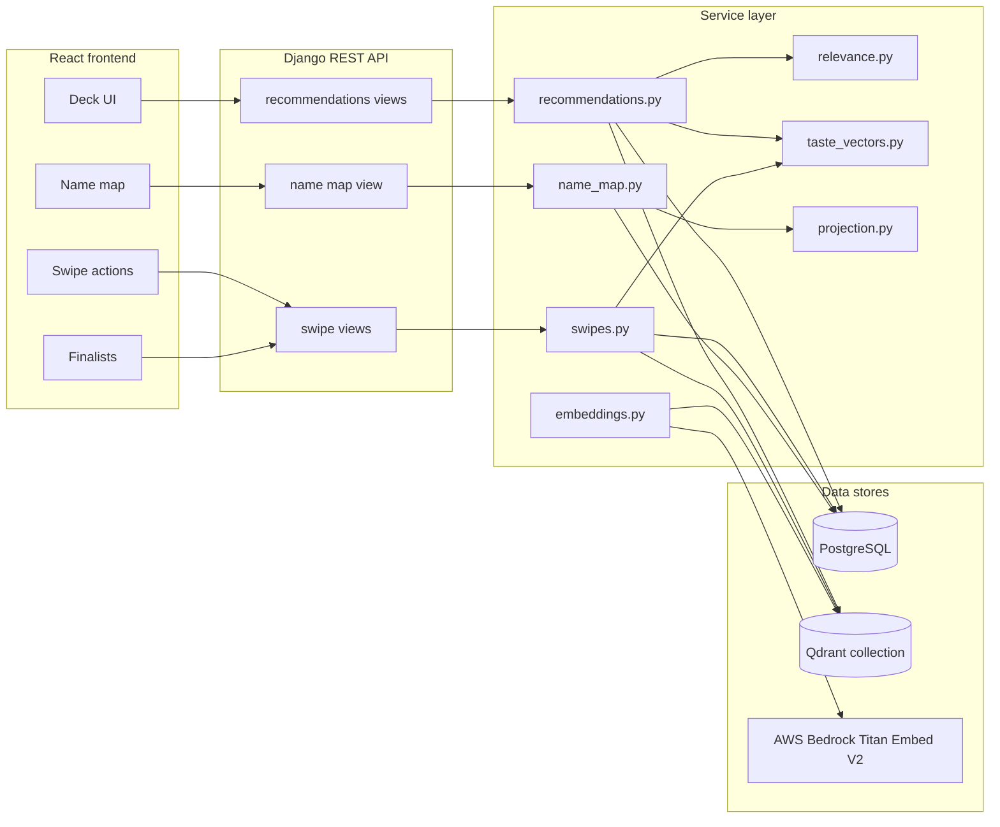

## Code Map

The recommendation behavior is split intentionally:

| Area | Main files | Responsibility |
| --- | --- | --- |
| Deck API | `core/views/recommendations.py` | Validate request, reuse cached decks, return response envelopes. |
| Deck creation | `core/services/recommendations.py` | Select vector space, query Qdrant, rerank, diversify, persist deck. |
| Relevance scoring | `core/services/relevance.py` | Compute weighted relevance signals in the `[0.0, 1.0]` range. |
| Swipe behavior | `core/views/swipes.py`, `core/services/swipes.py` | Validate deck/name/couple provenance, record swipes, create matches. |
| Taste vectors | `core/services/taste_vectors.py` | Learn per-user vectors from swipes and decide Phase C vs Phase D. |
| Embeddings | `core/services/embeddings.py` | Build embedding text and call Bedrock Titan Embed V2. |
| Qdrant access | `core/services/qdrant_client.py` | Search named vectors, filter payloads, retrieve anchor vectors. |
| Indexing | `core/management/commands/index_names_to_qdrant.py` | Generate named vectors and payloads for active names. |
| PCA projection | `core/services/projection.py`, `core/management/commands/compute_projections.py` | Convert 1024-dimensional semantic vectors into 2D map coordinates. |
| Name map | `core/services/name_map.py` | Assemble displayed map points, statuses, reasons, and neighborhoods. |

## Data Model Concepts

The recommendation system depends on a few core concepts:

- `Name`: canonical baby-name record with metadata and optional `x_2d` / `y_2d` visualization coordinates.
- `NameVectorIndexRef`: maps a `Name` to a Qdrant point ID.
- `Couple`: recommendation scope. Swipes and matches are scoped to a couple.
- `Swipe`: a user's action on a name, usually `like`, `dislike`, or `maybe`.
- `MutualMatch`: created when both partners in a two-person couple like the same name.
- `RecommendationDeck`: cached recommendation batch for one couple and mode.
- `RecommendationDeckItem`: a persisted deck item with score, rank, reason, and Qdrant result metadata.
- `UserTasteVector`: learned per-user vector used for Phase D personalization after enough reliable swipes exist.

The important invariant is that swipes and matches are not global. They are scoped to the user's current couple.

## Vector Indexing

Each active name is indexed into Qdrant with three named 1024-dimensional vectors. All three vectors use the same Bedrock model, but they are generated from different text representations of the name.

| Qdrant vector name | Built from | Used by |
| --- | --- | --- |
| `semantic` | Meaning, origin, style, historical significance, summary text | Best match, bridge names, more like this, wildcard, PCA visualization |
| `phonetic_style` | Pronunciation and sound-shape features | Sounds like |
| `cross_cultural` | Languages, scripts, variants, international usability | Cross-cultural mode |

The collection is created by `index_names_to_qdrant` with named vectors:

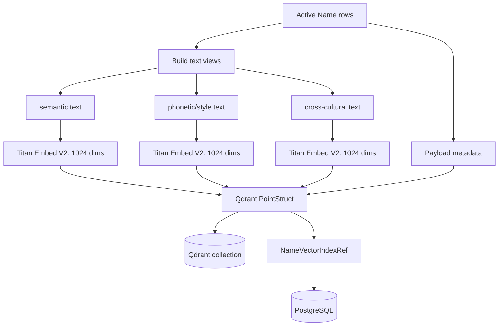

The Qdrant payload includes fields used by filters and reranking, including:

- `name_id`
- `canonical_name`
- `gender_usage`
- `origin_backgrounds`
- `languages`
- `length_category`
- `age_style_category`
- `historical_importance`
- `international_score`
- `active`

### Example Indexing Text

For a name like `Samuel`, the three embedding texts are intentionally different:

```text
semantic:
Name: Samuel
Origins: Hebrew
Style: traditional
Meaning and summary: heard by God; classic biblical name
Historical importance: high

phonetic_style:
Name: Samuel
Sound key: S-M-L
Starts with: sa
Ends with: el
Vowel pattern: aue
Consonant pattern: sml
Syllables: 3

cross_cultural:
Name: Samuel
Languages: English, Hebrew, Spanish, Portuguese, French
Scripts and variants: Samuel, Samuele, Samuil
International usability: high
```

This separation matters. `More like this` should find names that are semantically similar. `Sounds like` should find names with similar sound shape. If the phonetic text collapses into the same origin/variant text as the semantic text, those two features will overlap too much.

## Deck Generation

The frontend calls:

```http
POST /api/v1/recommendations/deck/
```

with a body like:

```json
{
  "mode": "best_match",
  "force_refresh": false
}
```

`force_refresh` controls cache behavior:

- Initial deck loads should use `false`.
- Manual refreshes should use `true`.
- Cached responses return HTTP `200` with `"cached": true`.
- Fresh deck responses return HTTP `201` with `"cached": false`.

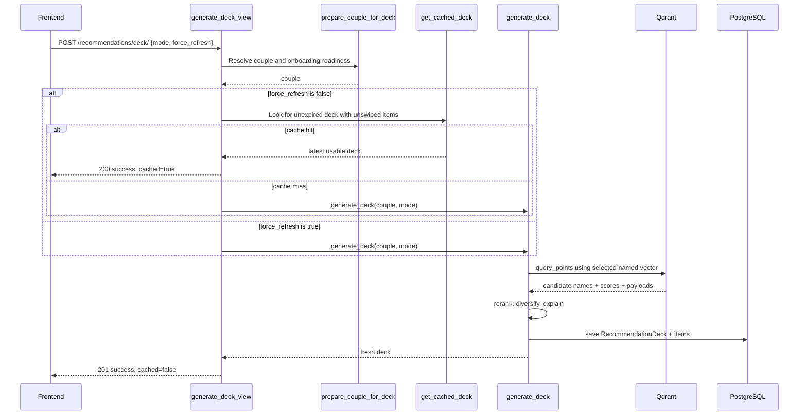

### Couple Preparation

`prepare_couple_for_deck` resolves whether the current user can receive recommendations:

- A solo user who completed solo onboarding can get recommendations without a partner.
- A solo user with no couple and incomplete onboarding is sent through preferences first.
- A two-person couple needs both users to have completed onboarding.
- The active couple is the unit for swipes, deck cache, exclusions, and matches.

### Deck Cache Reuse

The service reuses a previous deck only when all of these are true:

- Same couple.
- Same mode.
- Deck has not expired.
- Deck still has unswiped items for the current couple.
- Request did not use `force_refresh: true`.

This prevents unnecessary Qdrant and Bedrock work, while still allowing the user to manually refresh.

## Recommendation Modes

Each mode chooses a query embedding and Qdrant vector space.

| Mode | Query embedding | Qdrant vector | Main intent |
| --- | --- | --- | --- |
| `best_match` | Phase D taste midpoint if both users have trusted taste vectors, otherwise Phase C couple preference embedding | `semantic` | Best overall recommendations |
| `bridge_names` | Bridge centroid for both parents' preferences | `semantic` | Names that connect both backgrounds |
| `more_like_this` | Average semantic vector of mutual matches | `semantic` | Names similar in meaning, style, and cultural context |
| `sounds_like` | Average phonetic vector of mutual matches | `phonetic_style` | Names similar in sound shape |
| `cross_cultural` | Average cross-cultural vector of mutual matches, or profile fallback | `cross_cultural` | Names that travel across cultures and languages |
| `wildcard` | Couple profile embedding with wider retrieval and special rerank boost | `semantic` | Plausible surprises outside obvious matches |

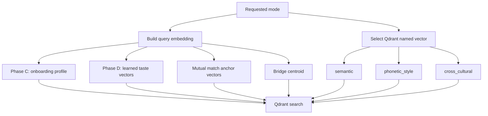

## Phase C vs Phase D Personalization

The system starts with Phase C recommendations, then moves to Phase D when behavior data is strong enough.

### Phase C

Phase C uses onboarding preference data:

- Preferred gender usage.
- Parent backgrounds.
- Residence country.
- Languages.
- Style and length preferences.
- Importance preferences.

The service turns the couple profile into an embedding query and searches the `semantic` vector space.

### Phase D

Phase D uses learned taste vectors from swipes. The system recomputes a user's taste vector after every 5 swipes, but it trusts a vector only when quality thresholds are met:

| Threshold | Value |
| --- | --- |
| Minimum swipes | `20` |
| Minimum like rate | `0.1` |
| Maximum like rate | `0.8` |
| Freshness window | `30` days |
| Minimum retrieval score | `0.6` |

Taste vectors are computed from liked names:

- Recent likes get more weight, using a 14-day half-life.
- If the like rate is extremely high and enough dislikes exist, the dislike centroid repels the taste vector.
- Confidence is based on swipe count, like-rate quality, staleness, and fallback quality.
- For a two-person couple, the Phase D query is a confidence-weighted midpoint of both trusted user vectors.

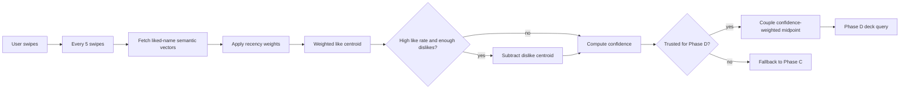

## Qdrant Candidate Retrieval

`search_names` is the low-level search function. It validates the embedding length, builds a Qdrant filter, and searches the selected named vector.

Inputs:

- `embedding`: 1024-dimensional vector.
- `filters`: active status, gender usage, length, style, or other payload filters.
- `limit`: usually a multiple of the target deck size.
- `exclude_ids`: Qdrant point IDs already swiped by the couple.
- `vector_name`: `semantic`, `phonetic_style`, or `cross_cultural`.

The search includes `active = true` by default and adds `must_not` conditions for excluded point IDs.

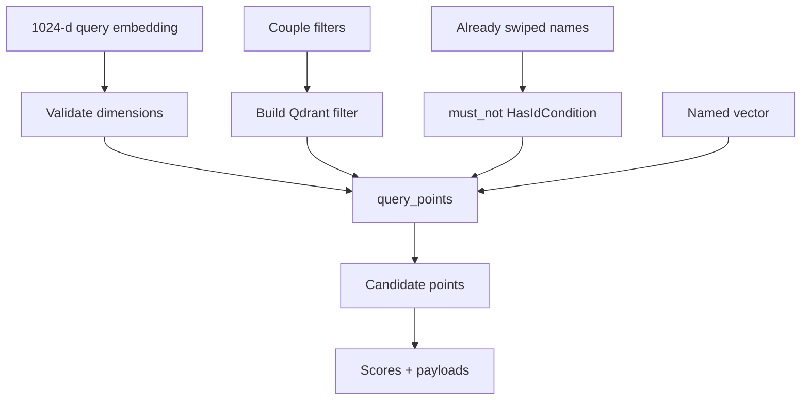

If the initial filtered search returns no candidates, deck generation retries with only `active = true`. This makes recommendations more resilient when preference filters are too strict.

## Reranking

Qdrant returns nearest neighbors in the chosen vector space. BabyBase then reranks those candidates using explicit product signals.

The weighted scoring contract is:

```text
final_score =
  semantic_fit   * 0.35 +
  couple_overlap * 0.20 +
  filter_fit     * 0.15 +
  bridge         * 0.10 +
  novelty        * 0.10 +
  diversity      * 0.10
```

All signals are floats in `[0.0, 1.0]`. Missing preference data is neutral and should not crash deck generation.

| Signal | Meaning |
| --- | --- |
| `semantic_fit` | Normalized Qdrant retrieval score. |
| `couple_overlap` | How well the name's origins overlap with both parents' preferred backgrounds. |
| `filter_fit` | Fit against explicit preferences such as length, style, and historical importance. |
| `bridge` | Whether the name bridges both parents' backgrounds or residence-language context. |
| `novelty` | Whether the name introduces origins not already represented in the current deck. |
| `diversity` | Whether the name adds variety in first letter, origin, and style. |

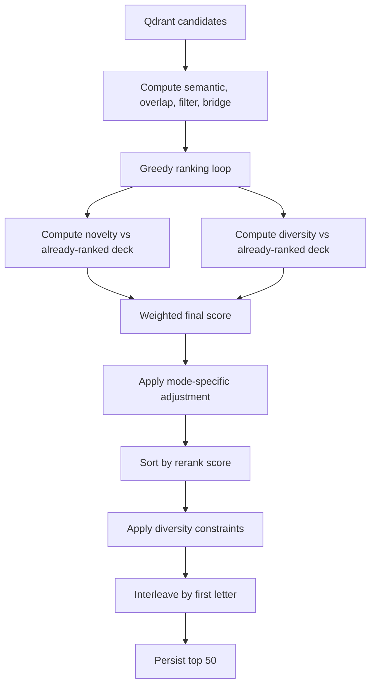

### Mode-Specific Adjustments

After the base weighted score, some modes apply additional boosts:

- `bridge_names`: adds a bridge boost.
- `wildcard`: boosts diversity, novelty, and latent compatibility over direct similarity.
- `cross_cultural`: boosts international usability.
- `sounds_like`: relies primarily on the `phonetic_style` vector space rather than a special score boost.

### Diversity Constraints

The deck is capped at 50 items. To avoid obvious repetition, deck generation limits how many names can share:

- The same first letter.
- The same origin.
- The same style category.

High-scoring names can bypass some constraints. If the pool is sparse, constraints relax so the deck can still be filled.

### Example Candidate Scoring

Assume a couple is generating a `best_match` deck and Qdrant returns `Mateo` as a candidate:

```text
semantic_fit:   0.82
couple_overlap: 0.50
filter_fit:     0.90
bridge:         0.75
novelty:        1.00
diversity:      1.00

final_score =
  0.82 * 0.35 +
  0.50 * 0.20 +
  0.90 * 0.15 +
  0.75 * 0.10 +
  1.00 * 0.10 +
  1.00 * 0.10

final_score = 0.797
```

The persisted deck item stores the score, rank, explanation, Qdrant point ID, and retrieval metadata so the frontend can render a stable deck without recomputing it.

## Worked Example: Creating A Deck

Suppose a couple has these preferences:

```json
{
  "parent_a_backgrounds": ["Hebrew", "Spanish"],
  "parent_b_backgrounds": ["Irish"],
  "residence_country": "United States",
  "preferred_gender": "unisex",
  "preferred_styles": ["classic", "international"],
  "preferred_lengths": ["short", "medium"]
}
```

For a first `best_match` deck:

1. The frontend sends `mode = best_match` and `force_refresh = false`.
2. The API checks for a cached unexpired `best_match` deck with unswiped items.
3. If no cache exists, the service prepares a Phase C couple profile embedding.
4. Qdrant searches the `semantic` vector space.
5. Names already swiped by the couple are excluded.
6. Payload filters keep active names and apply relevant gender/style/length constraints.
7. The service reranks candidates with the weighted scoring formula.
8. The service applies diversity constraints and first-letter interleaving.
9. The top 50 names are saved as a `RecommendationDeck`.
10. The API returns the deck with `cached = false`.

For a later deck after both users have enough reliable swipe history:

1. Each user's `UserTasteVector` has passed the trust thresholds.
2. The service selects Phase D.
3. The query vector becomes the confidence-weighted midpoint of both users' learned taste vectors.
4. Retrieval still happens in the `semantic` vector space for `best_match`.
5. Reranking and deck persistence work the same way.

## Swipes And Mutual Matches

Swipes are validated server-side because frontend state can be stale or manipulated.

Validation checks:

- The user belongs to the couple.
- The submitted name exists and is active.
- If `deck_id` is provided, the deck belongs to the same couple.
- If `deck_id` is provided, the deck contains the submitted name.
- Duplicate swipes are graceful and do not create false matches.

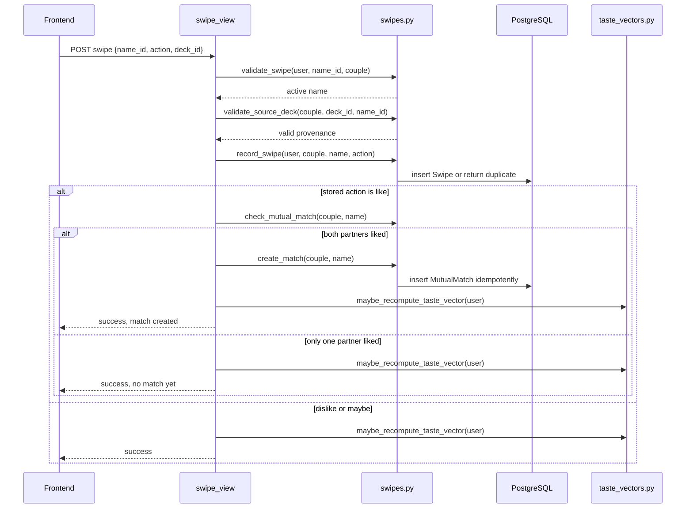

### Match Example

Assume Alex and Jordan are in the same couple:

1. Alex likes `Samuel`.
2. The service records Alex's swipe.
3. No match exists yet because Jordan has not liked `Samuel`.
4. Jordan later likes `Samuel`.
5. The service sees both partners have `like` swipes for the same active name in the same couple.
6. A `MutualMatch` is created.
7. The matched name can now be used as an anchor for match-scoped similar-name features.

Solo couples can receive recommendations, but they do not create mutual matches because there is no partner to confirm the name.

## Finalists

The UI label is `Finalists`. The backend route still uses the historical shortlist terminology for compatibility. Conceptually, finalists are names the couple has chosen to keep under active consideration.

Finalists differ from matches:

- A match is behavioral: both partners liked the same name.
- A finalist is intentional: the couple has elevated a name to a saved decision set.
- The name map and downstream UI can treat finalists as a higher-priority status than ordinary likes or recommendations.

## More Like This And Sounds Like

The similar-name features are anchor-based. They retrieve the selected name's stored vector, then search the same vector space for nearby names.

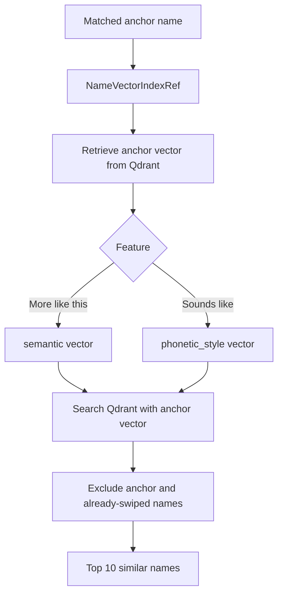

`More like this` uses the `semantic` named vector. It should return names that share meaning, style, origin context, or cultural usage.

`Sounds like` uses the `phonetic_style` named vector. It should return names that share sound shape, syllable pattern, starts/ends, rhyme, or pronunciation traits.

### Why Overlap Can Happen

Overlap between these two lists can be legitimate when a cluster is both semantically and phonetically close. For example, `Samuel`, `Emanuel`, and `Manuel` share sound endings and also have related cultural usage.

Too much overlap usually indicates one of these issues:

- The anchor name has weak phonetic metadata.
- The phonetic fallback text is too semantic or too origin-heavy.
- Qdrant still contains old vectors after the embedding text builder changed.
- The candidate space is small after filters and exclusions.

When phonetic text changes, Qdrant must be reindexed before `sounds_like` behavior changes in the app.

## Cross-Cultural Search

Cross-cultural mode is distinct from ordinary semantic matching. It searches the `cross_cultural` vector space, which is built from text about languages, scripts, variants, and international usability.

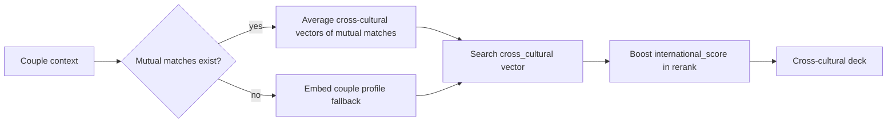

This means cross-cultural recommendations can share some results with best-match recommendations, but the retrieval basis and reranking emphasis are different.

## PCA Name-Map Visualization

The name map uses the `semantic` vector space. It does not use the phonetic or cross-cultural vectors.

The goal is to place names in a 2D coordinate system where semantic neighbors tend to appear near each other. The projection is computed offline by `compute_projections`.

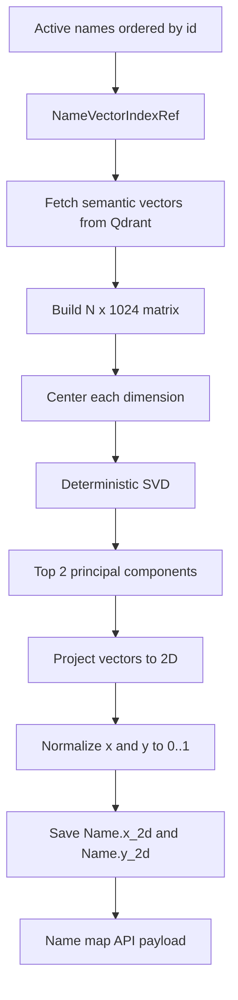

The PCA math is:

```text
X        = matrix of semantic vectors, shape N x 1024
X_center = X - mean(X)
SVD      = X_center = U * S * Vt
PCs      = first two rows of Vt
coords   = X_center * PCs.T
```

Then each axis is min-max normalized to `[0.0, 1.0]`. If an axis is degenerate, every point on that axis is assigned `0.5`.

The implementation also fixes component sign deterministically. PCA axes can otherwise flip sign between runs while still being mathematically equivalent. The sign convention makes the generated map stable.

### PCA Example

Imagine a tiny semantic matrix with four names:

```text
Name       Vector dimensions, simplified
Samuel     [0.70, 0.10, 0.40, ...]
Daniel     [0.68, 0.12, 0.38, ...]
Mateo      [0.20, 0.80, 0.35, ...]
Saoirse    [0.10, 0.65, 0.90, ...]
```

PCA finds the two directions that explain the most variation across the full set of vectors. After projection and normalization, the map might place `Samuel` and `Daniel` near each other because their semantic vectors are close, while placing `Mateo` and `Saoirse` elsewhere based on different origin, language, and style signals.

The exact axes are not manually named. They are latent semantic directions learned from the vector distribution.

## Name Map Assembly

`name_map.py` decides which names appear and how they are annotated. It pulls from:

- Mutual matches.
- Finalists.
- Recent likes.
- Latest unswiped deck recommendations.
- Starter representatives from onboarding preferences.

It assigns display statuses with priorities:

| Status | Priority |
| --- | --- |
| Finalist | `60` |
| Matched | `50` |
| Liked by you | `40` |
| Liked by partner | `30` |
| Recommended | `20` |
| Starter | `10` |

Neighborhoods are grouped by style and primary origin, then summarized for the UI. The map is therefore not just raw PCA points. It combines vector geometry with the user's actual state in the app.

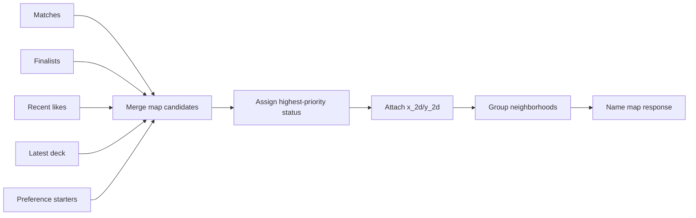

## Recommendation Reliability Rules

The system is designed to preserve these behavior contracts:

- Deck generation excludes names already swiped by the couple.
- Duplicate swipes are graceful.
- Matches require both partners to like the same name in the same couple.
- A swipe with a deck ID must refer to a deck owned by the user's couple.
- A swipe with a deck ID must refer to a name actually present in that deck.
- Cached decks are reused only when they still contain unswiped items.
- Missing preference data is neutral for scoring.
- Similar-name features use the correct named vector space.
- PCA coordinates are generated from semantic vectors only.

## Operational Notes

When the embedding text builders or Qdrant payload schema changes, existing Qdrant vectors are stale until reindexed.

For this project, AWS commands should use the configured `erick_admin` profile and should verify identity before touching AWS:

```bash
export AWS_PROFILE=erick_admin
export AWS_REGION=us-east-1
aws sts get-caller-identity
```

Common maintenance commands:

```bash
# Reindex active names into Qdrant and recompute PCA projections.
uv run python manage.py index_names_to_qdrant --force-recreate --batch-size 10

# Recompute PCA coordinates from existing Qdrant semantic vectors.
uv run python manage.py compute_projections --force
```

Use a small batch size when calling Bedrock to avoid rate-limit pressure. The indexing command persists `NameVectorIndexRef` rows and, unless skipped, recomputes projections after indexing.

## Debugging Guide

### Deck Looks Too Repetitive

Check:

- Are diversity constraints being bypassed because most candidates have high scores?
- Is the candidate pool too small after filters and exclusions?
- Is the same cached deck being reused instead of a forced refresh?
- Are origins/styles missing from payloads, causing diversity to see less variation?

Useful files:

- `core/services/recommendations.py`
- `core/services/relevance.py`

### More Like This And Sounds Like Are Too Similar

Check:

- Does the `phonetic_style` named vector exist in Qdrant?
- Was Qdrant reindexed after phonetic text changes?
- Does the anchor name have a rich `phonetic_profile`?
- Is the fallback phonetic text sound-shape based rather than semantic?
- Are filters leaving only a tiny candidate set?

Useful files:

- `core/services/embeddings.py`
- `core/services/qdrant_client.py`
- `core/services/swipes.py`
- `core/management/commands/index_names_to_qdrant.py`

### Recommendations Ignore User Taste

Check:

- Does each user have at least 20 swipes?
- Is the like rate between 0.1 and 0.8?
- Are taste vectors fresh enough?
- Did `maybe_recompute_taste_vector` run after recent swipes?
- Is `select_phase` falling back to Phase C with a reason?

Useful file:

- `core/services/taste_vectors.py`

### Name Map Points Are Missing

Check:

- Does each active `Name` have `x_2d` and `y_2d`?
- Does a `NameVectorIndexRef` exist for the name?
- Can Qdrant retrieve the semantic vector for the point ID?
- Were projections recomputed after reindexing?

Useful files:

- `core/services/projection.py`
- `core/management/commands/compute_projections.py`
- `core/services/name_map.py`

## End-To-End Example: From Name Data To Match

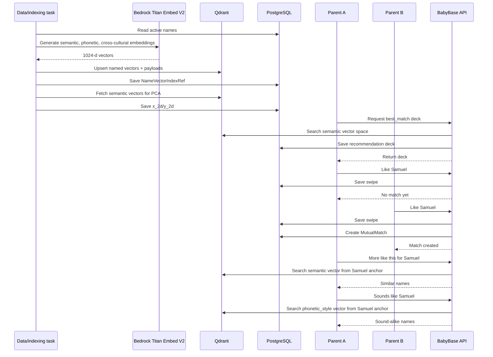

This is the full recommendation loop: curated name data becomes embeddings, embeddings power Qdrant search, search results become ranked decks, swipes create matches, and matches become anchors for deeper exploration.
